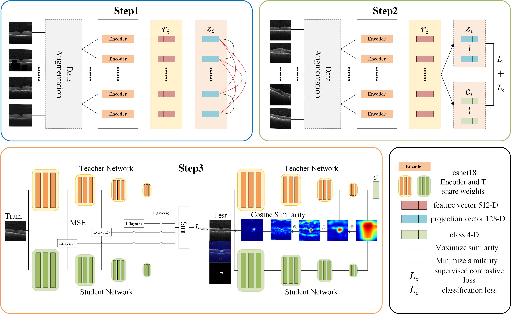

# Pre-training, Fine-tuning and Distillation: Weakly-Supervised Anomaly Localization and Segmentation for OCT images

### Usage
~~~
# python==3.8, 
# torch==1.9.0, 
# torchvision==0.10.0
~~~

#### Acknowledgement
Some of the code is adapted from [SupContrast](https://github.com/HobbitLong/SupContrast) and [STPM](https://github.com/hcw-00/STPM_anomaly_detection). 
